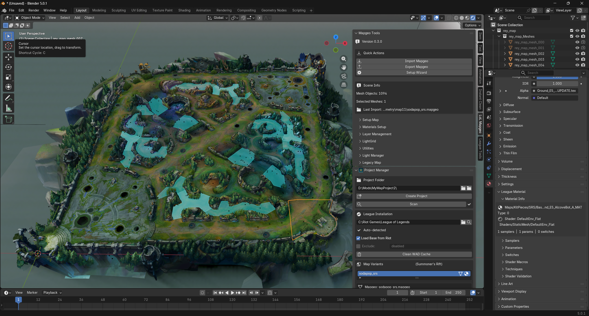
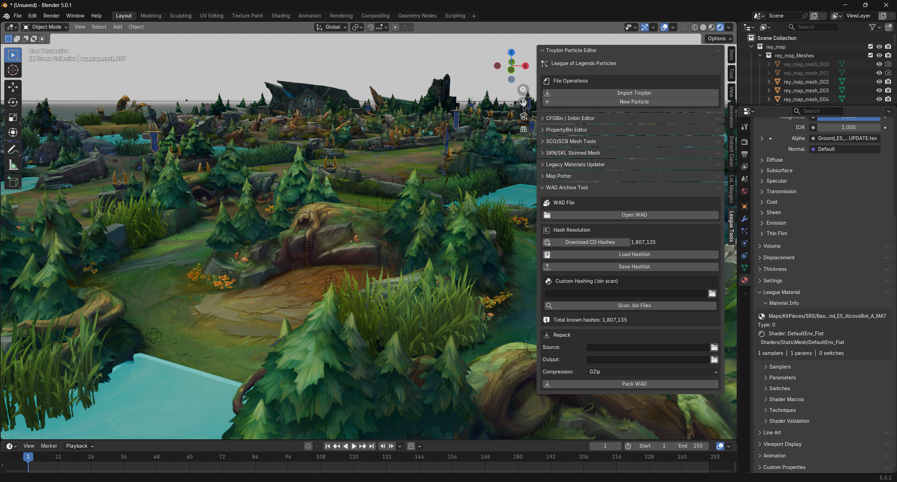
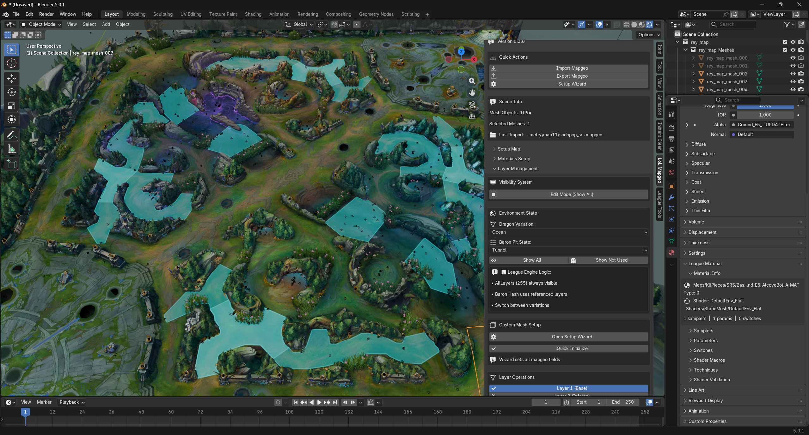

# Rey's Mapgeo Blender Addon

Import, edit, and export League of Legends maps in Blender, including map geometry, materials, particles, and map objects.

## Highlights

- Import and export .mapgeo files
- Import and update .materials.bin data
- Auto-import MapParticle placements from materials
- Auto-import GdsMapObject placements from materials
- Edit transforms in Blender and write back to .bin or .prey
- Project Manager workflow for variant loading and export
- League Tools suite (Troybin, WAD, SCO/SCB, SKN/SKL, PropertyBin, CFGBin)

## Credits

Original code for importing League files by LeagueToolkit: https://github.com/LeagueToolkit/LeagueToolkit

Inspired by LolMaya now included in LtMAO: https://github.com/tarngaina/LtMAO

We use also files from CommunityDragon: https://raw.communitydragon.org

## Requirements

- Blender 5.0+
- Windows (primary tested platform)
- League install path for Riot-base and WAD workflows

Pillow is generally not required to install manually in current versions.

## Installation

1. Download this repository as ZIP (or clone it).
2. In Blender: Edit -> Preferences -> Add-ons.
3. Install the ZIP and enable the addon.
4. Open Sidebar (N) in 3D View:
   - LoL Mapgeo tab (main tools)
   - League Tools tab (project manager and advanced tools)

## Quick Start

1. Open League Tools -> Project Manager.
2. Set project folder and League installation path.
3. Scan/load a map variant.
4. Map, particles, and map objects import automatically when linked data exists.
5. Edit in scene.
6. Export with Export to Project, or use .prey Save All workflow.

## Map Objects (GdsMapObject)

GdsMapObject items are imported from MapPlaceableContainer entries in materials data.

- Imported as empties
- Grouped by container collections
- Stable item_key matching for safe round-trip updates
- Export supported to:
  - merged materials.bin
  - prey.vfx via Save All to .prey

## .prey Workflow

Use Project Manager for split-file editing:

- Convert to .prey
- Save All to .prey writes:
  - map settings (sun/fog)
  - materials edits
  - particle transforms
  - map object transforms
  - vfx definition edits

## UI Panels

- LoL Mapgeo tab:
  - import/export
  - visibility and layer controls
  - utilities and light tools

- League Tools tab:
  - Project Manager
  - Troybin Particle Editor
  - WAD Tool
  - Legacy and low-level format editors

## Screenshots

- docs/screenshots/overview_topdown.png
- docs/screenshots/overview_ingame_angle.png
- docs/screenshots/layers_visibility.png

## License

MIT License. See [LICENSE](LICENSE).

